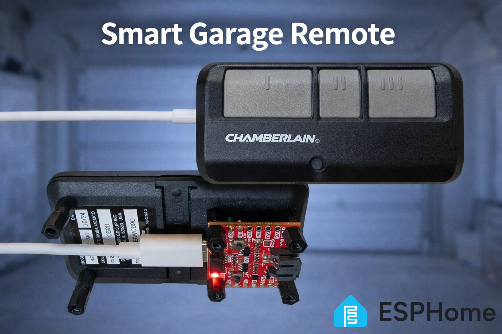
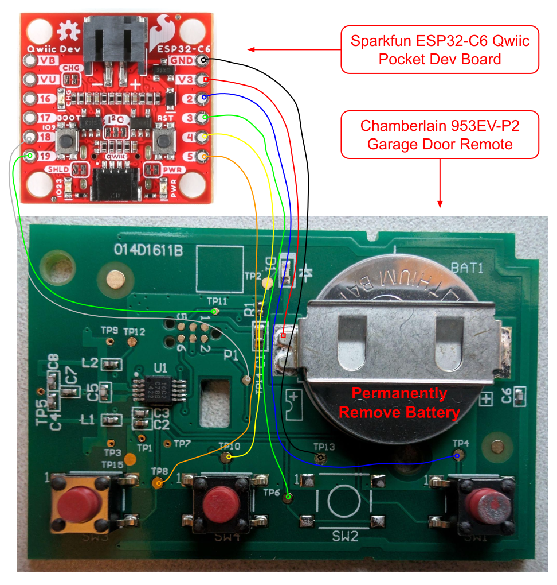

# Smart Garage Door Opener Remote

This projects aims to add the "smarts" to the [Chamberlain 953EV-P2]
garage door remote, for integration with Home Assistant. This is useful when
you don't want to hardwire one of the amazing smart garage door controllers,
like in a temporary rental property, or maybe in situations where you don't
have stable enough wifi or bluetooth in the garage (the Chamberlain remote has
better range).

## Diagram

## The Chosen Remote

I chose the [Chamberlain 953EV-P2] garage door remote due to it's configurable
compatibility with almost all generations of Chamberlain, LiftMaster, and
Craftsman garage door openers. It is also a major plus that one remote can
control three (possibly four) garage door openers.

Checkout the [953EV-P2 manual] for more details about which openers are
supported. There is a nice table that shows compatibility/protocol based on the
color of your garage door opener's learn button.

Checkout [REMOTE_TEARDOWN.md](REMOTE_TEARDOWN.md) for more detail about how we
will integrate with this remote.

[Chamberlain 953EV-P2]: https://www.chamberlain.com/3-button-visor-garage-door-remote/p/G953EV-P2MC
[953EV-P2 manual]: https://cgi.widen.net/content/uc9vrtoywt/original/114A5043.pdf?u=mcyivk&download=true

## MCU and Integration

Home Assistant seems to strongly prefer ESPHome for custom GPIO pressing stuff,
so we will make this work. I chose the ESP32-C6 due to it having support for
not only WiFi and BT, but also 802.15.4, with stacks ready zigbee, thread, and
matter. So, if we don't like ESPHome, we could integrate in a zillion different
ways.

**Components:**
* [SparkFun ESP32-C6 Pocket Dev Board](https://www.sparkfun.com/sparkfun-qwiic-pocket-development-board-esp32-c6.html)
  - https://cdn.sparkfun.com/assets/d/4/0/a/9/Qwiic_Pocket_Dev_ESP32_C6.pdf
  - https://cdn.sparkfun.com/assets/f/8/4/8/b/ESP32-C6-MINI-1-Datasheet.pdf
  - I'm not using GPIO16 and GPIO17, since these support UART TX/RX.
* [Plastic Standoffs](https://a.co/d/6FvDC4v)
* [Thin 30AWG Stranded Wire](https://a.co/d/5y5EgwZ)

   *In this case, you want something thin and flexible to ensure that bending
   the wire can't impart too much torque on the PCB pads being soldered to.
   Otherwise, you can end up accidentally ripping traces/pads off the PCB.*

**Connections:**

ESP32 Pin  |  Remote Test Point | Description            | Polarity      | Notes
---------- | -----------------  | ---------------------- | ------------- | -----
V3         | Battery+           | 3.3V                   |               |
GND        | TP13               |                        |               |
IO2        | TP4                | SW1 / Button I / C2DAT | active-low    |
IO3        | TP6                | SW2 *(unpopulated)*    | active-low    | Functions as extra garage door control.
IO4        | TP10               | SW4 / Button II        | active-low    |
IO5        | TP8                | SW3 / Button III       | active-low    |
IO18       | TP14               | SW5 / Program Button   | active-low    |
IO19       | TP11               | D1 / LED / C2CLK       | active-low    |
IO23       | N/A                | ESP32 Onboard LED      | active-high   |

*All active-low IO above should be driven in an open-drain/active-low manner.
The RF-MCU enables internal pull-ups on all IO, including the LED.*

### ESPHome Setup

* The ESPHome [device description yaml](garage-remote.yaml).
* Here is the board definition that we need, but isn't currently supported:
https://github.com/pioarduino/platform-espressif32/blob/53.03.13/boards/sparkfun_qwiic_pocket_esp32c6.json
