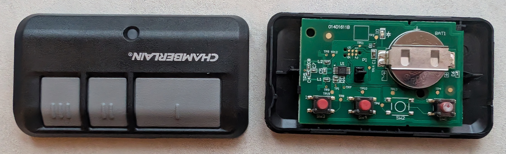

# Teardown of Chamberlain 953EV-P2 Remote

* The MCU is the Silicon Labs [Si4010-C2]. This is a simple 8051 MCU with a
  built-in sub-GHz radio, supporting FSK and OOK.
* Here is the Si4010-C2's [Datasheet].
* The MCU's datasheet specifies that it can handle between 1.8V to 3.6V, so 3.3V
  from our MCU should be fine.
* The internal pull-ups are enabled for each GPIO for buttons. Pushing the
  button grounds the GPIO.
* This schematic is basically a direct copy of the reference implementation in
  the Si4010-C2's [Datasheet]. Nothing found on this PCB is a surprise, other
  than the tag-connect footprint.
* This MCU supports a Silicon Labs debugging protocol called C2. It requires two
  active line called C2CLK (clock) and C2DAT (data). These are overloaded onto
  the LED driver line and GPIO4, the far-right button, respectively.

[Datasheet]: https://www.silabs.com/documents/public/data-sheets/Si4010.pdf
[Si4010-C2]: https://www.silabs.com/wireless/proprietary/ezradio-sub-ghz-ics/device.si4010-c2-gt?tab=specs